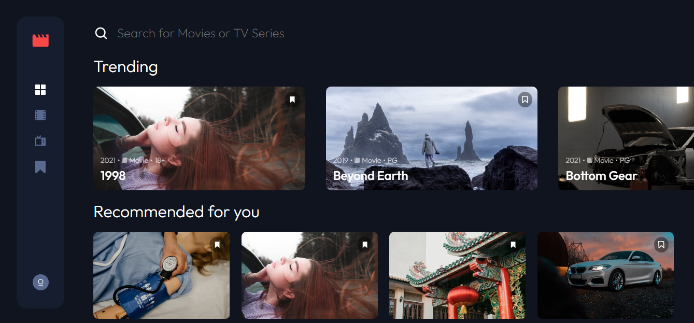
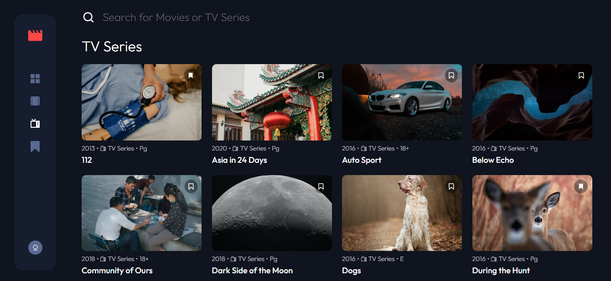
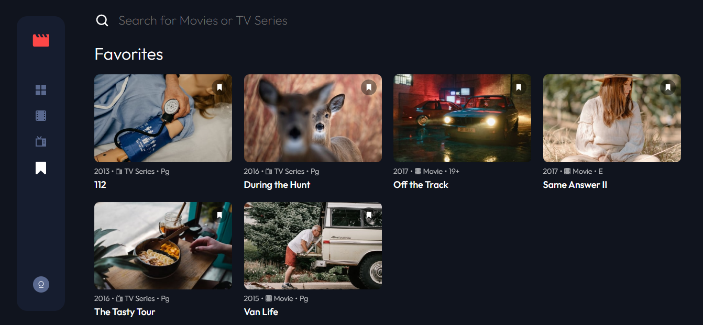
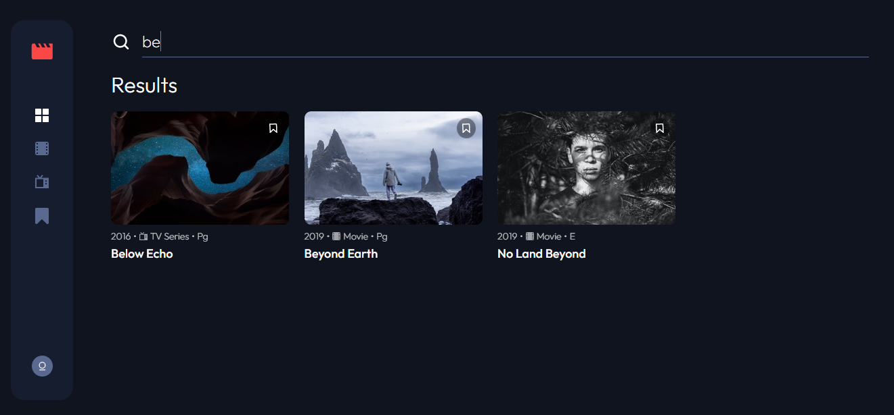
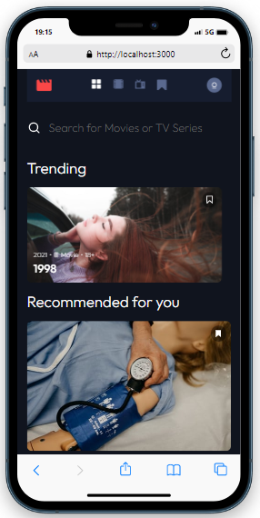
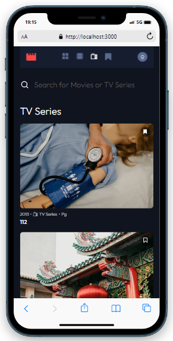

## Entertainment Web App

- Trata-se de uma interface inicial de um site sugestões de filmes e séries. O design foi inspirado pelo desafio publicado no site [**Frontend Mentor**](https://www.frontendmentor.io/).

## Sumário

- [Tecnologias utilizadas](#tecnologias)
- [Instruções para rodar o projeto](#instrucoes)
- [Organização e estruturação do projeto](#organizacao)
- [Desenvolvimento](#desenvolvimento)
- [Imagens](#imagens)

## Tecnologias Utilizadas <a name="tecnologias"></a>

- [**React**](https://pt-br.reactjs.org/)
- [**React Hooks**](https://pt-br.reactjs.org/docs/hooks-intro.html)
- [**Styled Components**](https://styled-components.com/)
- [**React Icons**](https://react-icons.github.io/react-icons/)
- [**React Router**](https://v5.reactrouter.com/web/guides/quick-start)
- [**Swiper JS**](https://swiperjs.com/)

## Instruções para rodar o projeto <a name="instrucoes"></a>

### Será necessário ter instalado na sua máquina:

```
Git
React
Vite
```

- Clone o repositório com o comando **git clone**:

```
git clone https://github.com/felipehimself/entertainment-web-app
```

- Entre no diretório que acabou de ser criado:

```
cd entertainment-web-app
```

- Para o projeto funcionar na sua máquina, será necessário instalar suas dependências, para isso, utilize o comando **npm install**:

```
npm install
```

- Pronto, agora o projeto está pronto para ser rodado localmente, utilizando o comando **npm run dev**:

```
npm run dev
```

## Organização e estruturação do projeto <a name="organizacao"></a>

O projeto está organizado e estruturado da seguinte forma:

```
────src
    │   App.tsx
    │   favicon.svg
    │   logo.svg
    │   main.tsx
    │   vite-env.d.ts
    │
    ├───assets
    │   ├───icons
    │   │       icon-bookmark.svg
    │   │       icon-category-movie.svg
    │   │       icon-category-tv.svg
    │   │       icon-nav-bookmark.svg
    │   │       icon-nav-home.svg
    │   │       icon-nav-movies.svg
    │   │       icon-nav-tv-series.svg
    │   │       icon-play.svg
    │   │       icon-search.svg
    │   │       logo.svg
    │   │
    │   └───images
    │           112.jpg
    │           1998.jpg
    │           1998large.jpg
    │           asia-in-24-days.jpg
    │           auto-sport-series.jpg
    │           below-echo.jpg
    │           beyond-earth-large.jpg
    │           beyond-earth.jpg
    │           bottom-gear-large.jpg
    │           bottom-gear.jpg
    │           community-of-ours.jpg
    │           dark-side-of-the-moon-large.jpg
    │           dark-side-of-the-moon.jpg
    │           darker.jpg
    │           dogs.jpg
    │           during-the-hunt.jpg
    │           earths-untouched.jpg
    │           lone-heart.jpg
    │           mission-saturn.jpg
    │           no-land-beyond.jpg
    │           off-the-track.jpg
    │           production-line.jpg
    │           relentless.jpg
    │           same-answer.jpg
    │           the-diary.jpg
    │           the-great-lands.jpg
    │           the-heiress.jpg
    │           the-rockies.jpg
    │           the-tasty-tour.jpg
    │           undiscoverd.jpg
    │           undiscovered-large.jpg
    │           unresolved-cases.jpg
    │           van-life.jpg
    │           whispering-hill.jpg
    │
    ├───components
    │   ├───header
    │   │       Header.tsx
    │   │       styles.ts
    │   │
    │   ├───list
    │   │       List.tsx
    │   │       ListCard.tsx
    │   │       styles.ts
    │   │
    │   ├───navbar
    │   │       Navbar.tsx
    │   │       styles.ts
    │   │
    │   └───slider
    │           Slider.tsx
    │           SliderItem.tsx
    │           styles.ts
    │
    ├───constants
    │       Styles.ts
    │
    ├───interfaces
    │       appInterfaces.tsx
    │
    ├───pages
    │       Bookmarks.tsx
    │       Home.tsx
    │       index.tsx
    │       Movies.tsx
    │       TvSeries.tsx
    │
    ├───shared
    │       Container.tsx
    │       GlobalStyles.tsx
    │       H2.tsx
    │
    ├───store
    │       context.tsx
    │       reducer.ts
    │
    └───utils
            data.ts
```

## Desenvolvimento <a name="desenvolvimento" ></a>

### Estilização

Para realizar a estilização, foi utilizado : [**Styled Components**](https://styled-components.com/).

Para ícones, foi utilizado: [**React Icons**](https://react-icons.github.io/react-icons/).

Para a implementação do slider superior foi utilizado: [**Swiper JS**](https://swiperjs.com/).

## Imagens <a name="imagens"></a>

### Desktop

 
 
 


### Mobile

 
 

